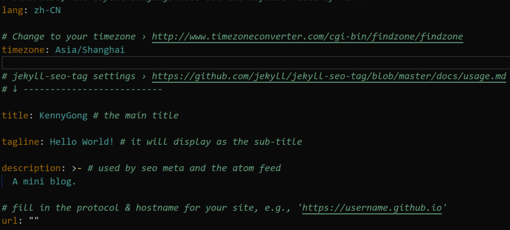

# Cloud Computing Lab9 Report
## 个人消息
姓名：龚知遥
学号：10194810401

## 博客主题及选取原因
使用`Chirpy`模板（cotes2020/chirpy-starter）参考助教的博客。
主题为`jekyll-theme-chirpy`，配色整体为深色，是我比较喜欢的类夜间模式主题。
模板整体功能ui划分明确，markdown的样式效果好（特别是代码）。
```python
print("Hello world!")
```

## 博客设计
阅读了他的guidance发现可以自定义asset中的css样式表，但是我觉得他这个模板整挺好，不想改了，所以没啥设计好讲

## 博客制作过程
看懂_config.yml就好了，例如修改部分参数

_config.yml_